# System Architecture

TicketSouq follows a **Spring Cloud microservices architecture** with two
communication planes:

- **Synchronous** — REST calls routed through the API Gateway (Spring Cloud
  Gateway MVC) and direct Feign HTTP clients between services for
  point-to-point queries.
- **Asynchronous** — Apache Kafka for event-driven communication, used
  primarily for the **Saga pattern** (distributed transaction orchestration)
  and cross-service event propagation.

All services register with **Eureka** (Discovery Server) and pull
configuration from a central **Config Server**. Each business service owns its
own **PostgreSQL** database. **Redis** is used for caching and rate-limiting
in the gateway; **Elasticsearch** powers event search in the event-service.

---

## Architecture Diagram

> **Legend:**
>
> | Line Style | Meaning |
> |------------|---------|
> | `-->` | Synchronous REST / Feign call |
> | `-.->` | Asynchronous Kafka event |
> | `---` | Direct database / infra connection |

```mermaid
flowchart TD
    %% ── Nodes ──
    Client("Client / Frontend")

    subgraph Edge ["Edge Layer"]
        GW["API Gateway<br/>Spring Cloud Gateway MVC"]
    end

    subgraph Services ["Business Services"]
        AUTH["Auth (in Gateway)"]
        US["User Service"]
        EV["Event Service"]
        RS["Reservation Service"]
        TS["Ticket Service"]
        PS["Payment Service"]
        VS["Venue Service"]
        NS["Notification Service"]
        AUS["Audit Service"]
    end

    subgraph Infra ["Infrastructure"]
        CS["Config Server"]
        DS["Discovery Server (Eureka)"]
        K["Kafka"]
        R["Redis"]
        ELASTIC["Elasticsearch"]
    end

    subgraph DBs ["Databases (PostgreSQL)"]
        US_DB[("User DB")]
        EV_DB[("Event DB")]
        RS_DB[("Reservation DB")]
        TS_DB[("Ticket DB")]
        PS_DB[("Payment DB")]
        VS_DB[("Venue DB")]
        NS_DB[("Notification DB")]
        AUS_DB[("Audit DB")]
    end

    %% ── REST / Feign Synchronous Calls ──
    Client -->|"entry point"| GW
    %% RoutesConfig.java registers route predicates for all services under /api/v1/<prefix>/*

    GW -->|"RoutesConfig.java: gateway routes /api/v1/user/**"| US
    GW -->|"RoutesConfig.java: gateway routes /api/v1/event/**"| EV
    GW -->|"RoutesConfig.java: gateway routes /api/v1/reservation/**"| RS
    GW -->|"RoutesConfig.java: gateway routes /api/v1/ticket/**"| TS
    GW -->|"RoutesConfig.java: gateway routes /api/v1/payment/**"| PS
    GW -->|"RoutesConfig.java: gateway routes /api/v1/venue/**"| VS
    GW -->|"RoutesConfig.java: gateway routes /api/v1/notification/**"| NS
    GW -->|"RoutesConfig.java: gateway routes /api/v1/audit/**"| AUS

    EV -->|"UserServiceClient.java: @FeignClient(name='user-service')"| US
    US -->|"AuthServiceClient.java: @FeignClient(name='api-gateway')"| AUTH
    TS -->|"EventServiceClient.java: @FeignClient(name='event-service')"| EV
    NS -->|"EventClient.java: @FeignClient(name='event-service', retry)"| EV

    %% ── Kafka Async Events ──
    AUTH -.->|"AuthEventPublisher.java: publishes USER_EMAIL_VERIFICATION,<br/>USER_PASSWORD_RESET, AUDIT_EVENT, ACCOUNTS_GENERATED"| K
    US -.->|"UserEventPublisher.java: publishes AUDIT_EVENT"| K
    EV -.->|"EventEventPublisher.java: publishes EVENT_CREATED, EVENT_CANCELLED,<br/>EVENT_ACTIVATED, EVENT_COMPLETED, RESERVATION_BEGIN,<br/>SAGA_LOCK_CONFIRM_REPLY, AUDIT_EVENT"| K
    RS -.->|"OutboxRelay.java: publishes saga commands<br/>(SAGA_PAYMENT_COMMAND, SAGA_TICKET_COMMAND, SAGA_LOCK_CONFIRM_COMMAND)"| K

    K -.->|"EventEventConsumer.java: consumes SAGA_LOCK_CONFIRM_COMMAND,<br/>SAGA_LOCK_CONFIRM_COMPENSATE"| EV
    K -.->|"SagaReplyConsumer.java: consumes RESERVATION_BEGIN,<br/>SAGA_PAYMENT_REPLY, SAGA_TICKET_REPLY,<br/>SAGA_LOCK_CONFIRM_REPLY"| RS
    K -.->|"SagaTicketCommandConsumer.java: consumes SAGA_TICKET_COMMAND<br/>SagaTicketCompensateConsumer.java: consumes SAGA_TICKET_COMPENSATE"| TS
    K -.->|"SagaPaymentCommandConsumer.java: consumes SAGA_PAYMENT_COMMAND<br/>SagaPaymentCompensateConsumer.java: consumes SAGA_PAYMENT_COMPENSATE"| PS
    K -.->|"NotificationEventConsumer.java: consumes PAYMENT_SUCCESS,<br/>PAYMENT_REFUNDED, USER_PASSWORD_RESET,<br/>USER_PASSWORD_CHANGE, USER_EMAIL_VERIFICATION,<br/>ACCOUNTS_GENERATED"| NS
    K -.->|"AuditEventConsumer.java: consumes AUDIT_EVENT<br/>(from all services)"| AUS

    %% ── Database Connections ──
    US ---|"JPA @Entity: User, Organization, OrgMember"| US_DB
    EV ---|"JPA @Entity: Event, Section, Seat, EventCategory,<br/>ZoneLock, SeatLock"| EV_DB
    RS ---|"JPA @Entity: Reservation, SagaInstance, OutboxEvent"| RS_DB
    TS ---|"JPA @Entity: Ticket, SeatTicket, ZoneTicket, EventSnapshot"| TS_DB
    PS ---|"JPA @Entity: PaymentModel, Payout"| PS_DB
    VS ---|"JPA @Entity: Venue, VenueTemplate"| VS_DB
    NS ---|"JPA @Entity: Notification, EmailJob, UserEmailProjection"| NS_DB
    AUS ---|"JPA @Entity: AuditLog"| AUS_DB

    %% ── Infra Connections ──
    GW -.->|"RedisConfig.java: token caching, rate-limiting"| R
    EV -.->|"ESSearchService.java + ElasticsearchEventRepository.java:<br/>event search indexing"| ELASTIC
```

---

## Component Definitions

### Edge Layer

| Component | Role | Key Config / Class |
|-----------|------|--------------------|
| **API Gateway** | Single entry point for all client requests. Performs JWT authentication, rate-limiting, security headers, and route forwarding to downstream services. | `api-gateway/.../config/RoutesConfig.java` `SecurityRulesConfig.java` `JwtAuthenticationFilter.java` |

### Business Services

| Service | Responsibility | Key Entities | Dependencies |
|---------|---------------|--------------|--------------|
| **Auth** | User registration, login, token refresh, password management, email verification. *Co-located inside the API Gateway module.* | `AuthCredential`, `RefreshToken` | — |
| **User Service** | User profiles, organizations, organizational memberships, role management. | `User`, `Organization`, `OrgMember` | Calls `Auth` via Feign for org unlock |
| **Event Service** | Event lifecycle, section/seat layout, locking mechanism (seat & zone), search, category management. | `Event`, `Section`, `Seat`, `EventCategory`, `ZoneLock`, `SeatLock` | Calls `User Service` via Feign for org name; uses Elasticsearch for search |
| **Reservation Service** | Reservation creation and Saga orchestration. Manages distributed transaction state via `SagaInstance` and outbox-pattern event publishing. | `Reservation`, `SagaInstance`, `OutboxEvent` | Publishes saga commands via Kafka outbox |
| **Ticket Service** | Ticket issuance (seat-based and zone-based), ticket validation/consumption, event snapshot caching. | `Ticket` (abstract), `SeatTicket`, `ZoneTicket`, `EventSnapshot` | Calls `Event Service` via Feign; consumes saga & event Kafka topics |
| **Payment Service** | Stripe payment processing, payout management, payment provider abstraction. | `PaymentModel`, `Payout` | Consumes and replies to saga payment topics via Kafka |
| **Venue Service** | Venue CRUD, venue layout templates with JSON-based seat/zone configuration. | `Venue`, `VenueTemplate` | — |
| **Notification Service** | In-app notifications and transactional email delivery (scheduled via `EmailJob`). | `Notification`, `EmailJob`, `UserEmailProjection` | Calls `Event Service` via Feign; consumes notification-related Kafka topics |
| **Audit Service** | Centralized audit logging for all services. Consumes `AUDIT_EVENT` topic from every service. | `AuditLog` | Consumes `AUDIT_EVENT` via Kafka |

### Infrastructure

| Component | Role |
|-----------|------|
| **Config Server** | Spring Cloud Config Server — serves centralized YAML/properties configuration to all services at startup and on refresh. |
| **Discovery Server (Eureka)** | Netflix Eureka — maintains a registry of all running service instances for load-balanced inter-service calls (`lb://` prefix in Feign and Gateway routes). |
| **Kafka** | Apache Kafka — asynchronous message broker used for saga orchestration, event lifecycle notifications, audit events, and email triggers. |
| **Redis** | In-memory cache used by the API Gateway for rate-limiting counters and token storage (refresh tokens, access tokens). |
| **Elasticsearch** | Full-text search engine used by the Event Service for indexed event search (title, organization, category with fuzziness). |

### Data Stores

| Database | Owner Service | Schema |
|----------|--------------|--------|
| **User DB** (PostgreSQL) | User Service | `users`, `organization`, `org_member` |
| **Event DB** (PostgreSQL) | Event Service | `events`, `event_categories`, `sections`, `seats`, `zone_locks`, `seat_locks` |
| **Reservation DB** (PostgreSQL) | Reservation Service | `reservations`, `saga_instances`, `outbox_events` |
| **Ticket DB** (PostgreSQL) | Ticket Service | `tickets` (single-table inheritance), `event_snapshots` |
| **Payment DB** (PostgreSQL) | Payment Service | `payment_model`, `payout` |
| **Venue DB** (PostgreSQL) | Venue Service | `venue`, `venue_templates` |
| **Notification DB** (PostgreSQL) | Notification Service | `notifications`, `email_jobs`, `user_email_projection` |
| **Audit DB** (PostgreSQL) | Audit Service | `audit_logs` |

---

## Communication Matrix

| Source | Target | Method | Mechanism | Evidence File |
|--------|--------|--------|-----------|---------------|
| Client | API Gateway | REST | HTTP | `api-gateway/.../config/RoutesConfig.java` |
| API Gateway | All services | REST | Gateway route | `api-gateway/.../config/RoutesConfig.java` |
| Event Service | User Service | Feign | `@FeignClient(name="user-service")` | `event-service/.../Client/UserServiceClient.java` |
| User Service | API Gateway (Auth) | Feign | `@FeignClient(name="api-gateway")` | `user-service/.../client/AuthServiceClient.java` |
| Ticket Service | Event Service | Feign | `@FeignClient(name="event-service")` | `ticket-service/.../client/EventServiceClient.java` |
| Notification Service | Event Service | Feign | `@FeignClient(name="event-service")` | `notification-service/.../client/EventClient.java` |
| API Gateway | Redis | Lettuce | `RedisTemplate` bean | `api-gateway/.../config/RedisConfig.java` |
| Event Service | Elasticsearch | Spring Data ES | `ElasticsearchRestTemplate` | `event-service/.../service/Search/ESSearchService.java` |
| Multiple services | Kafka | KafkaTemplate | Various publishers | `*Publisher.java` files |
| Multiple services | Kafka | @KafkaListener | Various consumers | `*Consumer.java` files |
| All services | PostgreSQL | JDBC / Hibernate | JPA `@Entity` classes | `<service>/.../model/*.java` |
